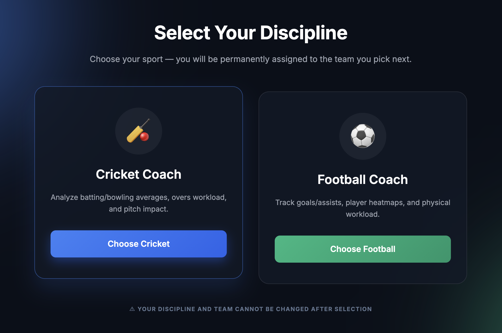
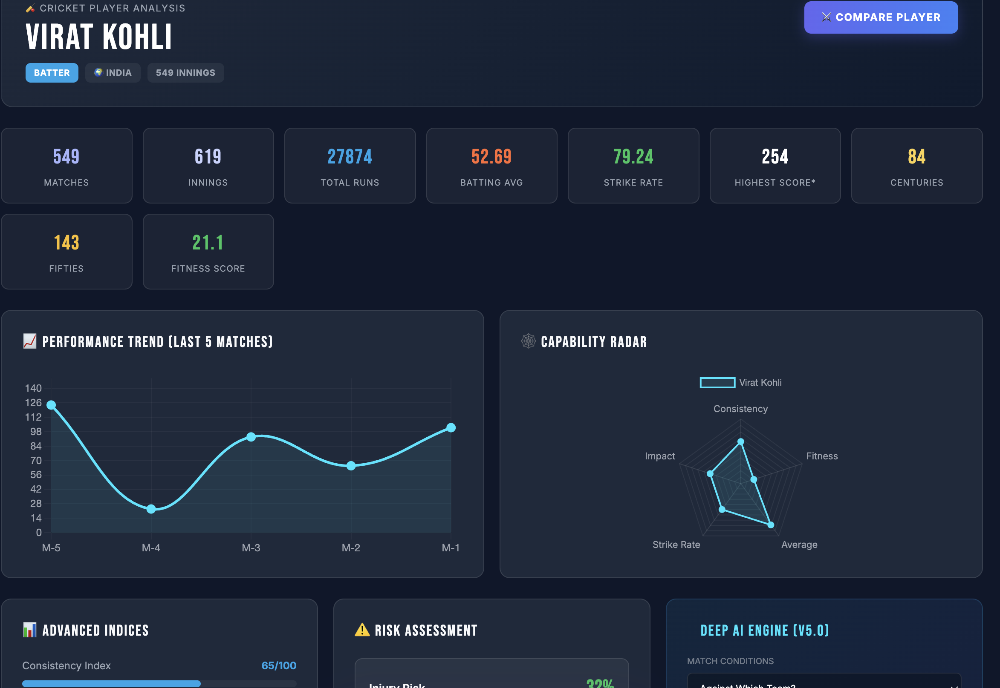
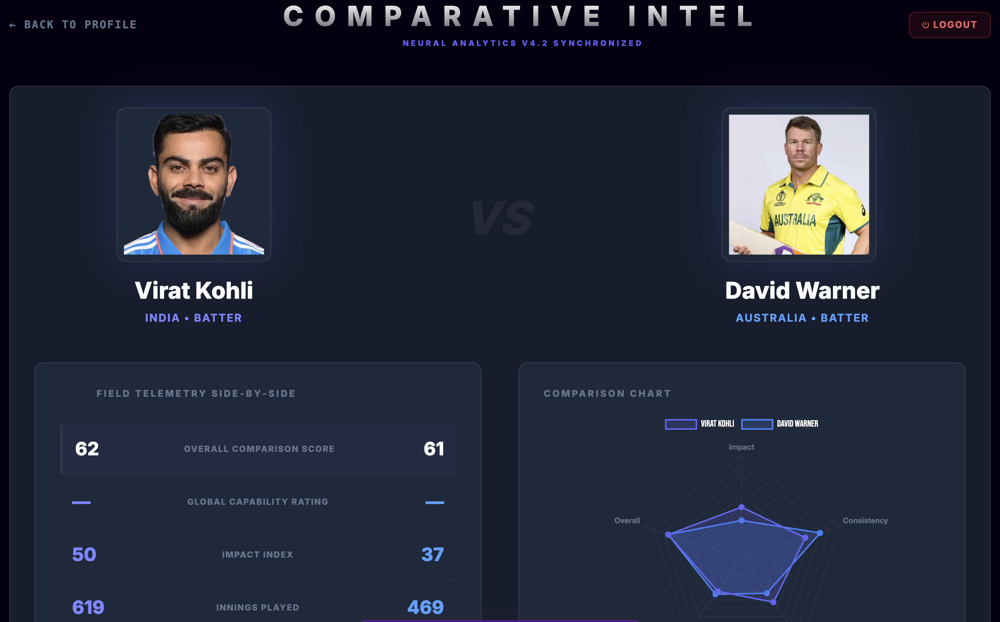

# 🏅 Sports Intel AI
### *Advanced Performance Analytics & Tactical Intelligence Platform*

[](https://reactjs.org/)
[](https://fastapi.tiangolo.com/)
[](https://firebase.google.com/)
[](https://scikit-learn.org/)
[](https://opensource.org/licenses/MIT)

**Sports Intel AI** is a professional-grade intelligence platform that bridges the gap between raw sports data and actionable tactical insights. Built for high-performance coaches and analysts, the system leverages machine learning to predict player performance, assess injury risks, and provide head-to-head tactical comparisons across **Cricket** and **Football**.

---

## 📸 Technical Showcase

<p align="center">
  
  <br>
  <i><b>Central Intelligence Hub:</b> Real-time selection and top-level performance overview.</i>
</p>

| AI Player Analysis | Tactical Head-to-Head |
| :---: | :---: |
|  |  |
| *Synthesizing 50+ data points into performance levels.* | *Direct AI-driven contrast of athlete efficiency.* |

---

## 🚀 Engineering Highlights

### 🧠 Machine Learning & Intelligence
- **Hybrid Inference Engine**: Combines historical statistical trends with modern predictive modeling (`RandomForest` & `LinearRegression`) to generate match-impact probabilities.
- **Dynamic Feature Scaling**: Automatically normalizes disparate sport metrics (e.g., Football goals vs. Cricket runs) into a unified **Tactical Performance Level (1-5)**.
- **Injury Risk Assessment**: Evaluates fatigue indicators and historical workload to provide a "Risk Score," enabling preemptive workload management.

### ⚡ Technical Implementation
- **Microservice Architecture**: Decoupled Python-based ML service (FastAPI) from the core Node.js application server for optimized inference and scalability.
- **Real-time Synchronization**: Uses Firebase Firestore for low-latency data updates and a global Warning System to alert coaches of squad selection issues.
- **Responsive UI/UX**: Built with Framer Motion for premium micro-interactions and TailwindCSS for a sleek, dark-mode-first "Pro-Coaching" aesthetic.

---

## 🛠 Tech Stack

- **Frontend**: `React 18`, `Vite`, `TailwindCSS`, `Framer Motion`, `React Context API`
- **Machine Learning Service**: `Python 3.11`, `FastAPI`, `Scikit-Learn`, `Pandas`, `Joblib`
- **Backend & Cloud**: `Firebase Cloud Functions`, `Firebase Auth`, `Firestore`
- **Data Engineering**: `Node.js`, `SQLite`, `Python (Data Scraping & Cleaning scripts)`

---

## 🏗 System Architecture

```text
sports-intelligence/
├── frontend/             # High-performance React SPA
├── backend/
│   ├── api/              # Serverless Node.js API (Firebase Functions)
│   ├── ml-service/        # Python Tactical Engine (FastAPI + ML Models)
│   ├── data/             # Curated datasets (JSON/SQLite)
│   └── scripts/          # Automation & Data Sync utilities
├── docs/                 # Architectural Blueprints & Media
└── firebase/             # Infrastructure as Code (Rules, Config)
```

---

## 📦 Local Development

### 1. Intelligence Engine (ML Service)
```bash
cd backend/ml-service
source .venv/bin/activate
pip install -r requirements.txt
uvicorn main:app --reload --port 8000
```

### 2. Core API (Firebase)
```bash
cd backend/api
npm install
npx firebase emulators:start --only functions
```

### 3. User Interface
```bash
cd frontend
npm install
npm run dev
```

---

## 🔒 Security & Performance
- **API Security**: ML Service protected by API key headers (`X-API-KEY`) to prevent unauthorized inference requests.
- **Data Integrity**: Firestore Security Rules ensure that only authorized coaching staff can modify player metrics.
- **Optimized Cold Starts**: ML models are lazily loaded to minimize memory footprint and reduce API response latency.

---

## Author

**Akhil Udumala**

GitHub: [Akhil-Udumala](https://github.com/Akhil-Udumala)
